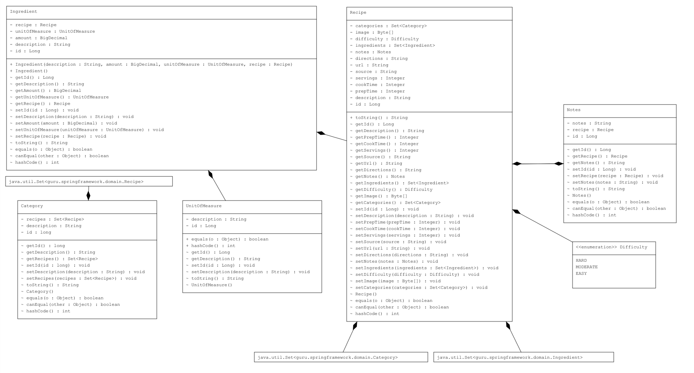
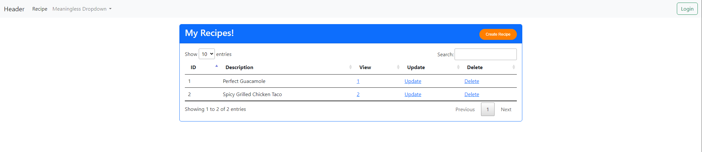
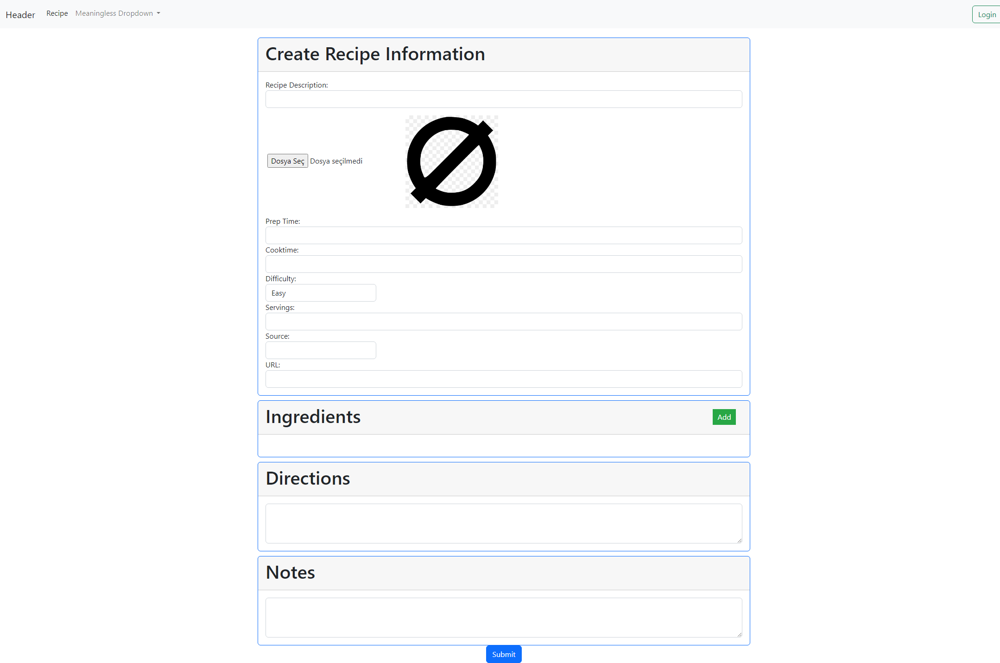
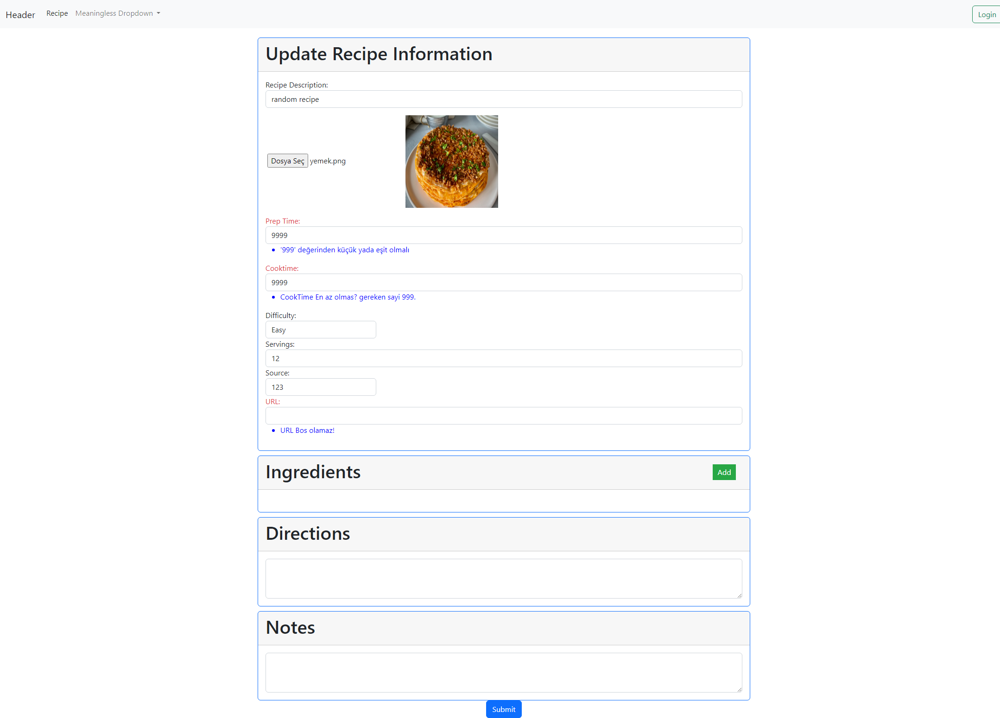
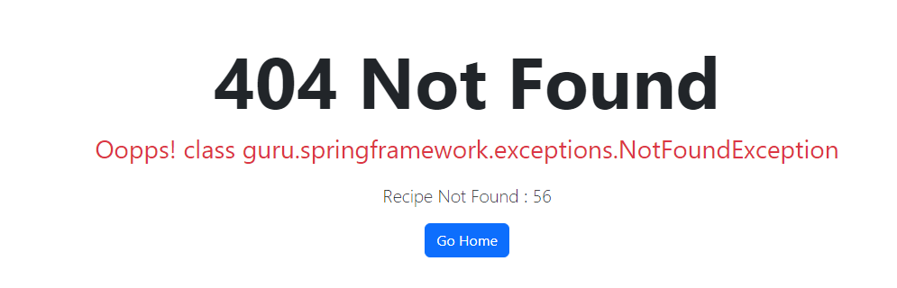

# Spring Boot Recipe Application

I forked this project from an empty branch to explore the forking process. You can view the original version [here.](https://github.com/springframeworkguru/spring5-recipe-app)
This application features a straightforward structure, allowing users to view, create, update, and delete Recipes and Ingredients.

# Data Structure

You can check the objects' relations in the image below.

- Used Command Pattern for the design. For more details, you can check classes in 'commands' and 'converters' folders. 
- Used Service Layer Pattern. For more details, you can check interfaces and classes in 'services' folder. 
- In the json folder, you'll find a custom JSON deserializer named UnitOfMeasureJsonDeserializer.java. This deserializer is designed to handle the deserialization of the UnitOfMeasure class within the Ingredient class when data is sent from the client-side as JSON.
- RecipeBootstrap.java in bootstrap folder is used for creating a few objects and persist them and use them as examples. It doesn't serve any other purpose.
- Application use data.sql inside the resources folder to send premade Categories and unit of measurement types and persist them in MySQL.
- As database, I used a MySQL image mounted on docker.

# Frontend

- Used Thymeleaf for server-side rendering.
- Used Bootstrap 5 to simplify the visual design and responsiveness of my web application.  
- Used a small amount of jquery, Javascript and CSS.

# Application

I designed this application to learn how JPA works with objects that have many relations, with 'Recipe' being the main object. Main index page is the recipe list page. Please note that a user interface design has not been planned for this project, and therefore, visual quality was not prioritized.

I've used Datatable template from jquery and Bootstrap. User can do create, read, update and delete operations. If a recipe is deleted, ingredients related to the recipe are also deleted. Create and Update operations use the same form.html file. If the user wants to update a recipe, recipe is added as an attribute to the model and sent to the form.

I've saved a default image for recipes without images. If a new image is selected, the previous image is replaced, and the newly selected image is displayed. Object validations are handled in their respective command classes. If the validation fails, the model is returned with errors, and these errors are then marked on the page.   
I implemented an 'Add' button on the Recipe page to dynamically add ingredients. Any number of ingredients can be created through this button. The ingredients generated in this manner do not get submitted through the form; instead, they are sent as JSON. Both the form and JSON data are then utilized in the controller. I tried this approach to test if it is possible to send a JSON object array along with the form.

I created a resource bundle to define error messages, providing both English and Turkish versions for the errors. However, I have not made error messages for every validation.  
I've implemented comprehensive exception handling by creating manual error handling classes in the 'exceptions' folder. Additionally, I've set up an 'CustomErrorController,' but it remains inactive as I handle errors primarily in the 'ControllerExceptionHandler' class with 'ControllerAdvice' annotation.

I've configured CircleCI for this project. However, Integration tests don't pass in the CircleCI image without a database. To fix this problem, I've excluded these tests in the pom. Instead, Integration tests can be done in application manually. It's important to note that these tests aren't meant to cover every scenario. Instead, I've tried different tests to explore various testing strategies.
